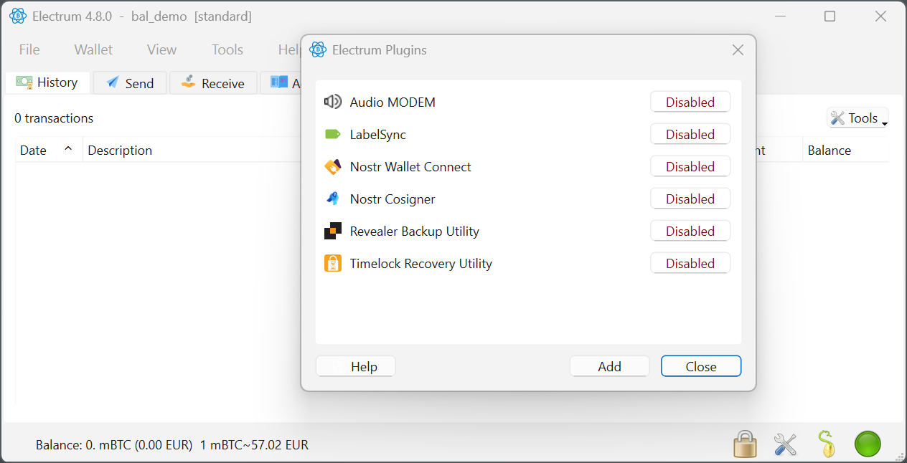
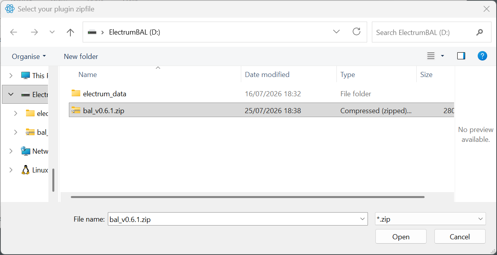
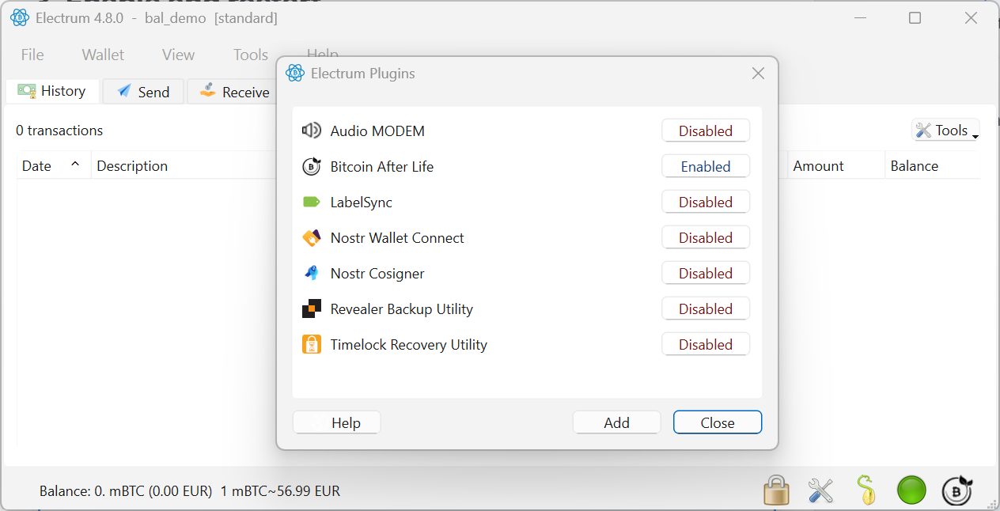

# :material-puzzle: Installation

## Requirements

| | |
|---|---|
| **Electrum** | {{ bal.electrum_latest }} (last stable release tested) |
| **Platform** | Desktop — Linux, Windows, macOS |
| **License** | MIT |
| **Wallet type** | Standard seed-based single-signature, or a [hardware wallet](../user-guide/hardware-wallets.md). See [Compatibility](../user-guide/compatibility.md). |

Install Electrum first, from the official site [electrum.org](https://electrum.org), and verify its signature as you normally would.

## 1. Download the plugin

Get the latest release from the [plugin releases page](https://bitcoin-after.life/gitea/bitcoinafterlife/bal-electrum-plugin/releases).

!!! tip "Verify the archive"
    Check that the zip's SHA-256 matches the value printed by `build_zip.py`. If you built the zip yourself from source, compare it against the published release.

## 2. Install it in Electrum

{ .screenshot }
*Electrum → Tools → Plugins.*

BAL is an **external plugin**, so it is added from a `.zip` file:

1. Open Electrum and go to **Tools → Plugins**.
2. **Internal plugins** are listed in the dialog — you toggle their checkbox to enable or disable them.
3. **External plugins** such as BAL are imported from `.zip` files with the **Add** button in the plugins dialog.
4. Some plugins (hardware wallets) are enabled automatically when you create or restore a hardware wallet.

{ .screenshot }
*Selecting the plugin archive, and click Open.*

### First-time setup: the plugin authorization password

The first time you load **any** external plugin, Electrum asks you to set a **plugin
authorization password**. Two things to know about it:

- It is **independent of your wallet password**, and it can be reset if you forget it.
- Setting it requires **administrator (root) permissions**, because Electrum writes a
  password-derived public key into the system. On later startups that key lets Electrum
  verify the plugin's authenticity without asking you for the password again.

!!! info "Why administrator permissions are needed"
    This is an Electrum security measure, not something specific to BAL. The elevated
    permissions are what stop **malware from silently installing or modifying plugins**,
    or from tampering with the stored key. External plugins can only be enabled by
    someone who can enter that password — so a piece of malware running as your normal
    user cannot enable one behind your back.

    Full details: [plugins.electrum.org](https://plugins.electrum.org/)

## 3. Enable and restart

Tick **Bitcoin After Life** in the plugin list, then restart Electrum.

{ .screenshot }
*The plugin enabled and ready.*

## 4. Check that it loaded

After restarting you will see a new tab in the Electrum window: **WILL** and **BAL ICON** at the bottom right.

{ .screenshot }
*WILL shows the technical state of your inheritance transactions.*

Next: [create your first will](quick-start.md).

## More on Electrum plugins

For how Electrum's plugin system works in general — internal vs external plugins, the
authorization password, and the plugin directory — see the official reference:
[plugins.electrum.org](https://plugins.electrum.org/)

---

!!! question "Still have a question?"
    The [FAQ](../faq.md) answers the most common ones — costs, hardware wallets,
    privacy, and what happens if a Will-Executor disappears.
