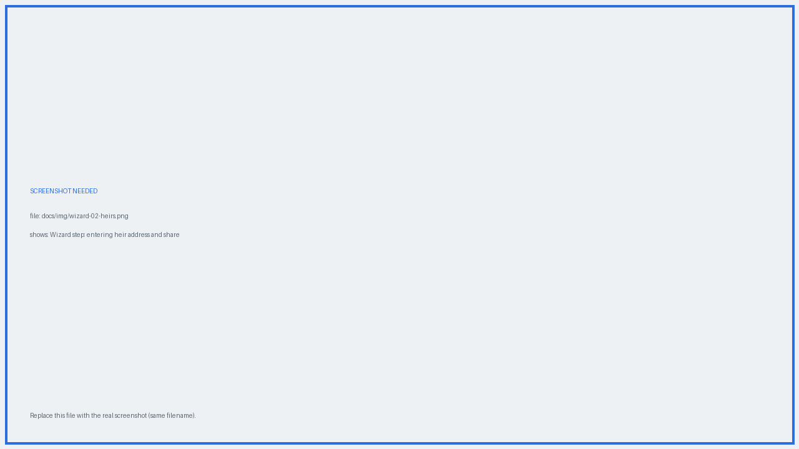
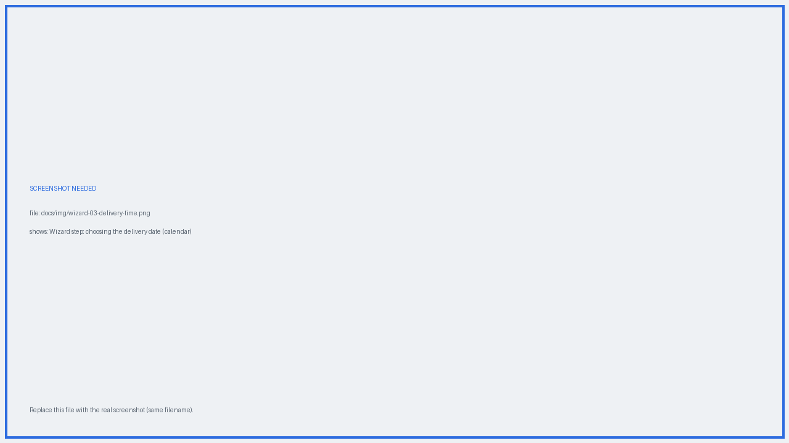

# Create your first will

The plugin ships with a **guided wizard** that walks you through the whole setup. You only need two decisions: *who inherits* and *when*.

!!! tip "Do a dry run first"
    Set a delivery time a few hours away on a test wallet, and watch the transaction move through the states in the [WILL tab](../user-guide/will-tab.md). On such a short horizon, remember to disable or back-date [Check Alive](../user-guide/check-alive.md) so it doesn't interfere.

## Step 1 — Start the wizard

{ .screenshot }
*The wizard walks through heirs, date, and Will-Executors in order.*

## Step 2 — Add your heirs

Enter the Bitcoin address of each heir and the share of the wallet they receive — as a percentage or as a fixed amount.

{ .screenshot }
*One row per heir. You can add as many as you need.*

The plugin always distributes **100%** of the wallet. If your shares don't add up, it recalculates them proportionally — see [Heirs and shares](../user-guide/heirs.md#the-wallet-is-always-emptied-to-100).

## Step 3 — Choose the delivery time

This is the date on which the Will-Executors broadcast the inheritance to the Bitcoin network.

{ .screenshot }
*You can pick a date from the calendar or express it as a relative delay.*

See [Delivery time](../user-guide/delivery-time.md) for how relative values and execution tolerance work.

## Step 4 — Select the Will-Executors

The plugin downloads the [WeList](../will-executors/welist.md) directory and shows the available servers with their fees.

{ .screenshot }
*Select as many as you can: one transaction is created per Will-Executor.*

!!! info "Pick many, not few"
    Each selected Will-Executor gets its own copy of the inheritance, with its own fee output. For the inheritance to succeed, **only one of them** has to still be operating on the delivery date. More servers means more redundancy.

## Step 5 — Review and sign

{ .screenshot }
*Review everything before signing.*

Electrum then asks for your wallet password — or confirmation on your hardware wallet — and signs the transactions. The plugin never signs for you.

Once signed, the wills are sent to the selected Will-Executors and appear in the [WILL tab](../user-guide/will-tab.md), where you can verify that each server has actually stored its copy.

## What happens from now on

- Keep using Electrum normally. The plugin watches your balance and asks you to refresh the will when it changes — see [Keeping the will up to date](../user-guide/updating.md).
- If you enabled [Check Alive](../user-guide/check-alive.md) (advanced mode), opening your wallet after the threshold prompts you to postpone the delivery date.
- If you stop opening Electrum, the Will-Executors broadcast the inheritance on the date you set.
