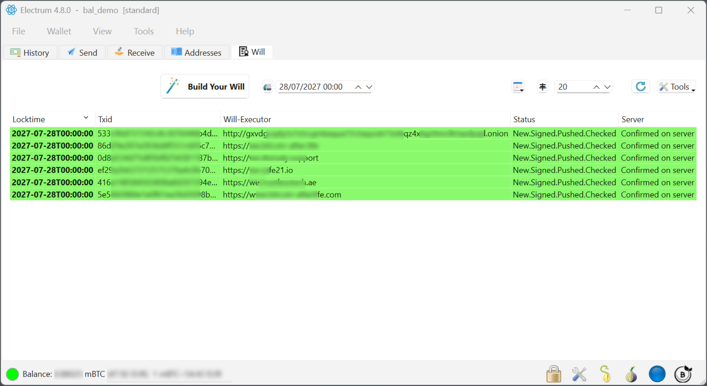

# Press &amp; Media Kit

Everything a journalist, podcaster, or researcher needs to cover **Bitcoin After Life (BAL)** — accurate, ready to quote, and free to use. If anything here is unclear or you need more, write to **press@bitcoin-after.life**.

!!! note "One-line summary"
    **Bitcoin After Life (BAL)** is an open-source Electrum plugin for decentralized Bitcoin inheritance: you set your heirs and a delivery date, your key signs a time-locked transaction, and a network of independent Will-Executor servers broadcasts it on that date. No notary, no lawyer, no custodian.

---

## Boilerplate — ready to copy

Three lengths, all approved for use as-is. No need to check back with us.

**Short (≈25 words)**

> Bitcoin After Life (BAL) is an open-source Electrum plugin enabling decentralized Bitcoin inheritance through time-locked transactions and a network of independent Will-Executor servers — no notary, no custodian.

**Medium (≈50 words)**

> Bitcoin After Life (BAL) is an open-source, non-custodial protocol and Electrum plugin for Bitcoin inheritance. Owners pre-sign a time-locked transaction that Bitcoin nodes reject until a chosen date; a decentralized network of incentivized Will-Executor servers then broadcasts it. Keys never leave the owner's device, and no single party can steal, alter, or accelerate anything.

**Long (≈100 words)**

> Bitcoin After Life (BAL) is an open-source protocol and Electrum plugin that makes Bitcoin inheritance possible without notaries, lawyers, or custodians. The owner selects heirs and a delivery date; the plugin builds a time-locked transaction, Electrum signs it locally, and a network of independent Will-Executor servers stores it and broadcasts it to the Bitcoin network on that date. Bitcoin's own consensus rules reject the transaction until the date arrives, so no one can execute it early. Security comes from redundancy and competition between servers, not from trusting any single one. The project is fully open source and funded entirely in Bitcoin.

---

## Fast facts

| | |
| --- | --- |
| **Name** | Bitcoin After Life (BAL) |
| **What it is** | Open-source protocol + Electrum plugin for decentralized Bitcoin inheritance |
| **Current version** | Plugin v{{ bal.plugin_version }} on Electrum {{ bal.electrum_tested }} *(check the [releases page](https://bitcoin-after.life/gitea/bitcoinafterlife/bal-electrum-plugin/releases) for the latest)* |
| **License** | MIT (open source) |
| **Cost** | Free plugin; Will-Executors are paid an on-chain fee only when they successfully broadcast |
| **Custody** | Non-custodial — keys never leave the user's device |
| **Listed on** | [Electrum's official third-party plugin directory](https://plugins.electrum.org/plugins.html) |
| **Origin** | First published on BitcoinTalk, 31 October 2024, signed *Svātantrya* |
| **Funding** | 100% Bitcoin — no fiat currency is involved anywhere in the project |
| **Team** | Pseudonymous by design (see below) |

---

## How it works, in one minute

- **Your keys never leave your device.** The plugin never signs on your behalf — it asks, you decide, with a password or hardware wallet.
- **The transaction is pre-signed and time-locked.** Bitcoin nodes reject it until the delivery date, so nobody can execute it early.
- **Will-Executors cannot steal or alter anything.** They only store the signed transaction and broadcast it at the right time.
- **Redundancy is the guarantee.** One transaction is created per selected Will-Executor; only one has to still be online on the delivery date.
- **The incentive is on-chain.** Each transaction carries a fee for its Will-Executor, paid only when that server successfully broadcasts and the transaction confirms.

For the full technical picture, see [How it works](protocol/how-it-works.md) and [Security &amp; Privacy](security-privacy.md).

---

## On anonymity — why the team is pseudonymous

<!-- DRAFT: written for you to review and adjust. Feel free to rewrite in your own voice. -->

Bitcoin After Life is maintained under the pseudonym **Svātantrya** — a Sanskrit word for autonomy, for absolute freedom that depends on nothing outside itself. The choice is deliberate, and it follows the tradition Bitcoin itself was born from.

A protocol that handles inheritance must be trusted to outlive the people who wrote it. Tying it to names, faces, or reputations would make it depend on those people — exactly the kind of single point of failure the protocol is designed to remove. Code that guards a family's savings for decades should stand on what it does, not on who signed it.

So we ask to be judged the way Bitcoin taught us to judge software: read the source, run it on testnet, verify the signatures, watch how it behaves over time. Everything needed to do that is public. The name behind it is not the point — and by design, it does not need to be.

We are fully available for written interviews, and for voice interviews with voice masking or text-to-speech where the format allows. What we will not do is trade the project's independence for personal visibility.

*— The BAL team*

---

## Official links

Use these to verify that a channel really is ours. Anything not listed here should be treated with caution.

| Resource | Link |
| --- | --- |
| Website | <https://bitcoin-after.life> |
| Manual / documentation | <https://bitcoin-after.life/docs/> |
| Plugin source &amp; releases | <https://bitcoin-after.life/gitea/bitcoinafterlife/bal-electrum-plugin> |
| Will-Executor server source | <https://bitcoin-after.life/gitea/bitcoinafterlife/bal-server> |
| Documentation source | <https://bitcoin-after.life/gitea/bitcoinafterlife/bal-docs> |
| All repositories (Gitea) | <https://bitcoin-after.life/gitea/bitcoinafterlife> |
| Public Will-Executor directory (WeList) | <https://welist.bitcoin-after.life/> |
| Electrum plugin directory listing | <https://plugins.electrum.org/plugins.html> |
| X (Twitter) | [@BitcoinAfterLif](https://x.com/BitcoinAfterLif) |
| Nostr | `npub1n0lp09j9ymm8hr3uepyu2va2dn4wks8xu5jqgzn72y9ech7una5q75efj2` — paste into any Nostr client. Web view: [njump.me](https://njump.me/npub1n0lp09j9ymm8hr3uepyu2va2dn4wks8xu5jqgzn72y9ech7una5q75efj2) |
| Origin thread | [BitcoinTalk, 31 October 2024](https://bitcointalk.org/index.php?topic=5516266.0) |
| Contact | **press@bitcoin-after.life** |

---

## Verifying our communications (PGP)

Official announcements can be signed with our PGP key, so you can confirm they really come from us.

- **Public key:** <https://bitcoin-after.life/svatantrya.asc>
- **Fingerprint:** `A847 D004 DB91 6107 11CA  6A0D FE75 6706 E833 E0D1`

To verify a signed message, import the key above and check the signature against this fingerprint. If a fingerprint does not match, the message is not from us.

---

## Brand assets

Logos are available in SVG (scalable, best for print and web). Please don't stretch, recolor, or add effects to the mark.

| Asset | File |
| --- | --- |
| Full logo | [logo.svg](https://bitcoin-after.life/docs/assets/logo.svg) |
| Logo mark — dark (for light backgrounds) | [logo-mark-black.svg](https://bitcoin-after.life/docs/assets/logo-mark-black.svg) |
| Logo mark — light (for dark backgrounds) | [logo-mark-white.svg](https://bitcoin-after.life/docs/assets/logo-mark-white.svg) |

### Screenshots

{ .screenshot }
*The WILL tab: a will time-locked to a delivery date, replicated across six independent Will-Executor servers — each row confirmed on-chain. Sensitive and identifying fields (txids, balance, server domains) are intentionally blurred.*

More views (such as the setup wizard) will be added here. For additional assets or a specific view, write to **press@bitcoin-after.life**.

### Download the press kit

[Download the press kit (ZIP)](assets/press/bal-press-kit.zip){ .md-button .md-button--primary }
*Everything above — logos, the WILL-tab screenshot, and the boilerplate text — in one archive.*

<!--
    To add more screenshots later:
    1. Put images in docs/assets/press/  (e.g. wizard.png)
    2. Reference them: { .screenshot }
    3. Optionally publish a bal-press-kit.zip (logos + screenshots) as a
       Gitea release asset or a static file, and link it here.
-->

---

## Story angles worth exploring

A few threads journalists have found interesting — offered as starting points, not talking points:

- **The unsolved problem of Bitcoin inheritance.** Self-custody means no one can help your heirs recover coins — unless you plan for it without reintroducing a custodian.
- **Trust through redundancy, not certification.** BAL never asks you to trust a server; it asks you not to depend on any single one. How the incentive and competition model works.
- **A pseudonymous project in the open.** How anonymity and full transparency coexist — public code, signed releases, a verifiable history going back to a dated BitcoinTalk post.
- **Built on Bitcoin only.** A project funded and operated entirely in Bitcoin, with no fiat anywhere in its design.
- **How it compares.** An honest look at BAL versus other inheritance approaches — see [How BAL compares](comparison.md).

---

## A note on accuracy

Two things we ask reporters to get right, because they matter:

1. BAL is **listed in Electrum's third-party plugin directory** — it is **not** built, endorsed, or reviewed by the Electrum developers. Third-party plugins are not vetted by them.
2. BAL is **non-custodial**. It never takes control of anyone's coins or keys. Will-Executors hold only a pre-signed transaction and cannot alter, spend, or accelerate it.

Questions, corrections, interview requests: **press@bitcoin-after.life**
