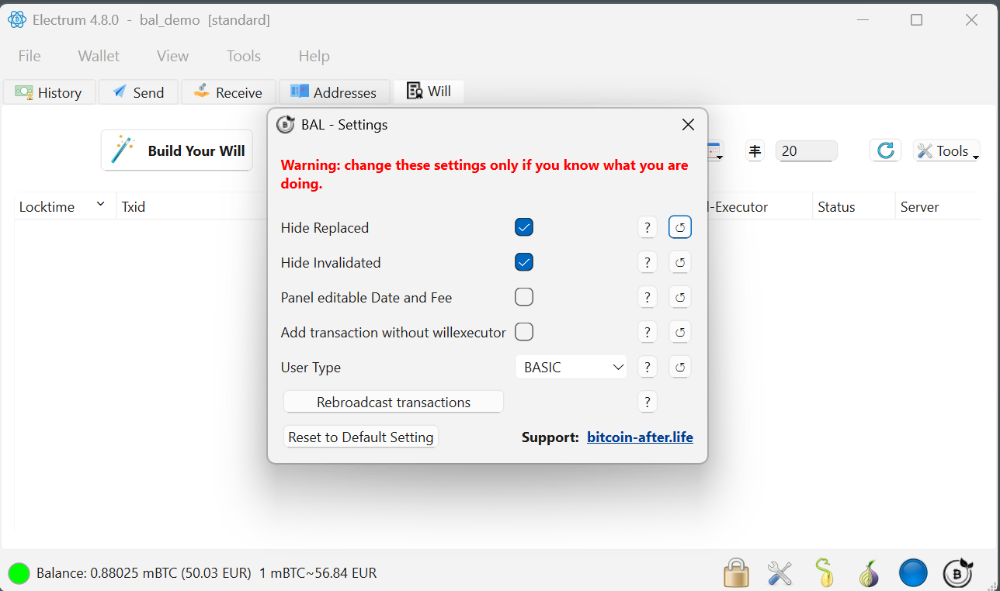

# :material-usb-flash-drive: Offline backup transaction

Beyond the Will-Executor network, the plugin can save the signed inheritance transaction to a **file you keep yourself**. It is the fallback for the (unlikely) scenario where every Will-Executor holding your will has ceased to operate.

{ .screenshot }
*Enable it in the plugin parameters.*

## How it works

With the option enabled, the signed transaction is also written to a file you can store on a USB stick, a NAS, or wherever you prefer.

{ .screenshot }
*Save the transaction to your medium of choice.*

You can then deliver it through a notary, a trusted person, or directly to the heir. On or after the delivery date, whoever holds it can broadcast it through Electrum and the funds move.

## The trade-offs, honestly

Relying on the offline backup alone has real drawbacks:

1. **It goes stale.** Any change to the wallet — a satoshi spent, a new heir, a different date — invalidates the saved file. You have to regenerate and redistribute it every time.
2. **It leaks information.** An heir who holds the file knows the exact date and amount of the inheritance, years in advance. That may not be prudent.
3. **Every step is manual**, with the corresponding risk of error.

!!! tip "Use it as a second layer, not the main plan"
    The recommended setup: select **as many Will-Executors as possible** — only one has to survive to the delivery date — and keep the offline backup as an additional safety net.

!!! warning "Digital media ages badly"
    Check the file periodically and re-save it to fresh media — USB sticks, SD cards, and similar storage degrade over time and can silently fail.

---

!!! question "Still have a question?"
    The [FAQ](../faq.md) answers the most common ones — costs, hardware wallets,
    privacy, and what happens if a Will-Executor disappears.
