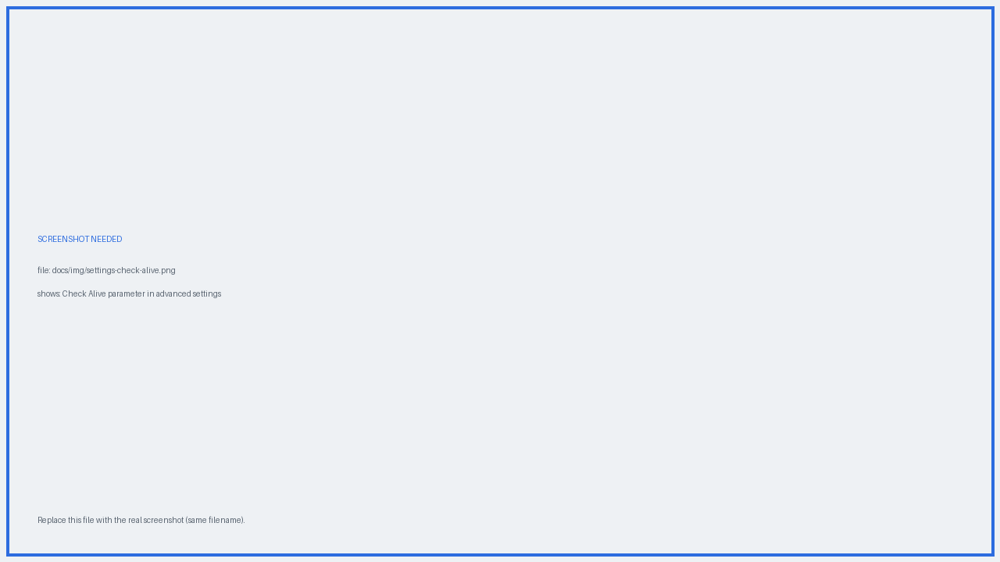

# Check Alive

**Check Alive** is the plugin's "are you still around?" mechanism. It is available in **advanced mode**.

{ .screenshot }
*Advanced mode exposes Check Alive and the other fine-grained parameters.*

## What it does

Check Alive defines a period of inactivity. When you open Electrum and more than that period has passed since the last postponement, the plugin asks whether you want to **push your delivery date further out** — because you are evidently still alive.

{ .screenshot }
*The threshold can be expressed as a relative period or an absolute date.*

## Example

You set a delivery date **2 years** out, with Check Alive at **6 months**.

| What you do | What happens |
|---|---|
| You open Electrum after 3 months | Nothing — you are inside the Check Alive window |
| You open Electrum after 7 months | The plugin points out that your delivery date is now only 1 year and 5 months away, and offers to postpone it |
| You stop opening Electrum altogether | Nothing postpones the will. On the delivery date, the Will-Executors broadcast it |

As long as you keep using Electrum within the Check Alive window and accept the prompts, your will is never executed.

!!! tip "Disabling it for a quick test"
    Setting Check Alive to a **date in the past** effectively switches it off. This is what you want when testing the plugin with a delivery time only a few hours away, so the prompt doesn't get in the way.

!!! warning "Postponing is not free"
    Accepting a postponement may require invalidating the previously committed transaction on-chain, which costs a miner fee. See [Postponing vs anticipating](updating.md#postponing-vs-anticipating).
