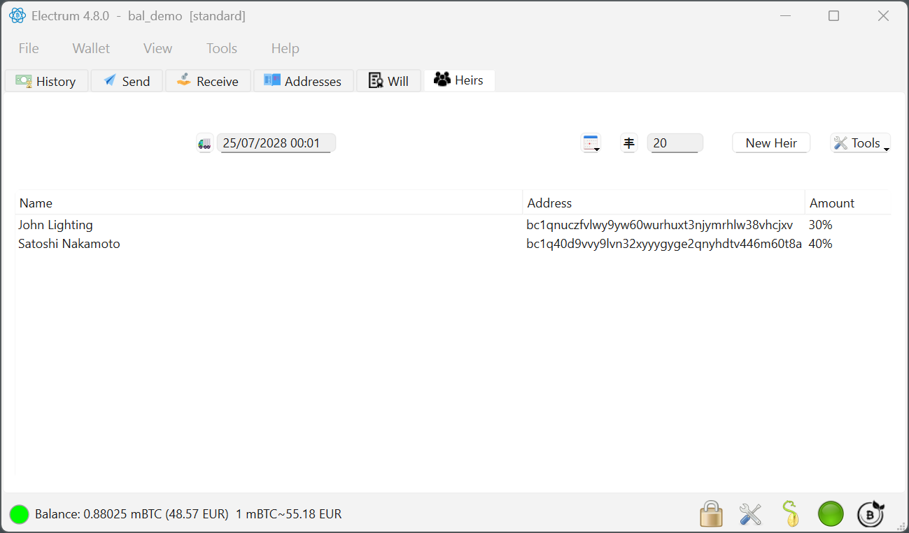
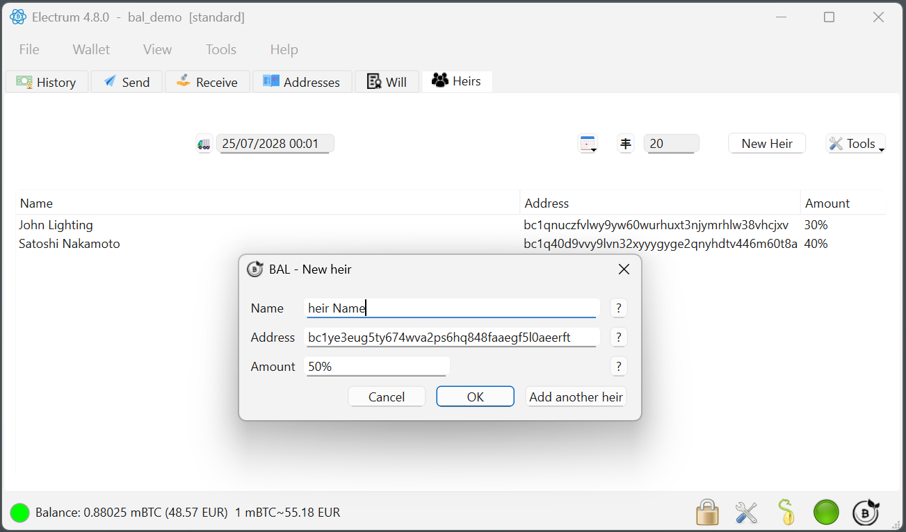

# :material-account-group: Heirs and shares

The **HEIRS** tab is where you define who receives your bitcoin.

{ .screenshot }
*Two heirs configured, with their shares.*

## Adding an heir

{ .screenshot }
*Name, destination address, and share.*

| Field | Meaning |
|---|---|
| **Name** | A label for the heir, with any details you find useful. Local only — it is never published on-chain. |
| **Address** | The Bitcoin address that will receive the inheritance. |
| **Amount** | The share, expressed either as a **percentage** of the wallet or as a **fixed amount**. |

You can add many heirs — ten or more.

!!! warning "Check the address twice"
    The inheritance is sent to exactly the address you type, potentially years from now, with nobody available to correct a mistake. Prefer copy-paste over typing, and ask your heir for a fresh address from a wallet they actually control.

## The wallet is always emptied to 100%

The plugin makes sure that **all** the value in the wallet reaches the heirs — never a leftover balance stuck behind.

| You set | The plugin sends |
|---|---|
| Wallet of 3 BTC: 1 BTC to Jonny, 10% to Andrea | 1 BTC to Jonny, **all the rest** (2 BTC) to Andrea |
| 5% to Jonny, 80% to Andrea | Recalculated proportionally: **5.9%** to Jonny, **94.1%** to Andrea |
| Wallet of 10 BTC: exactly 4 BTC to Jonny, exactly 2 BTC to Andrea | The remaining 4 BTC are redistributed — to keep the amounts exact, add a **third heir** (for example an address of your own) for those 4 BTC |

The rule to remember: **if your shares don't add up to 100%, the plugin scales them until they do.** If you want a specific portion to go somewhere else, name that destination explicitly as an additional heir.

!!! tip "Sending part of the wallet to yourself"
    Adding one of your own addresses as an heir is a legitimate pattern. It is how you keep amounts exact, and it also improves the privacy of the transaction, since the destinations become harder to interpret.

## One delivery date per wallet

In the current version the delivery date is **unique per wallet**. If you need different dates for different heirs — for example two children reaching 18 in different years — prepare **one wallet per date**. Electrum makes creating and managing multiple wallets straightforward.

!!! info "Planned for BAL 2.0"
    Staggered inheritance — distributing gradually over time, for example 10% per year — is in development for version 2 of the protocol. You'll be able to update your inheritance later with these new features as they become available.

---

!!! question "Still have a question?"
    The [FAQ](../faq.md) answers the most common ones — costs, hardware wallets,
    privacy, and what happens if a Will-Executor disappears.
