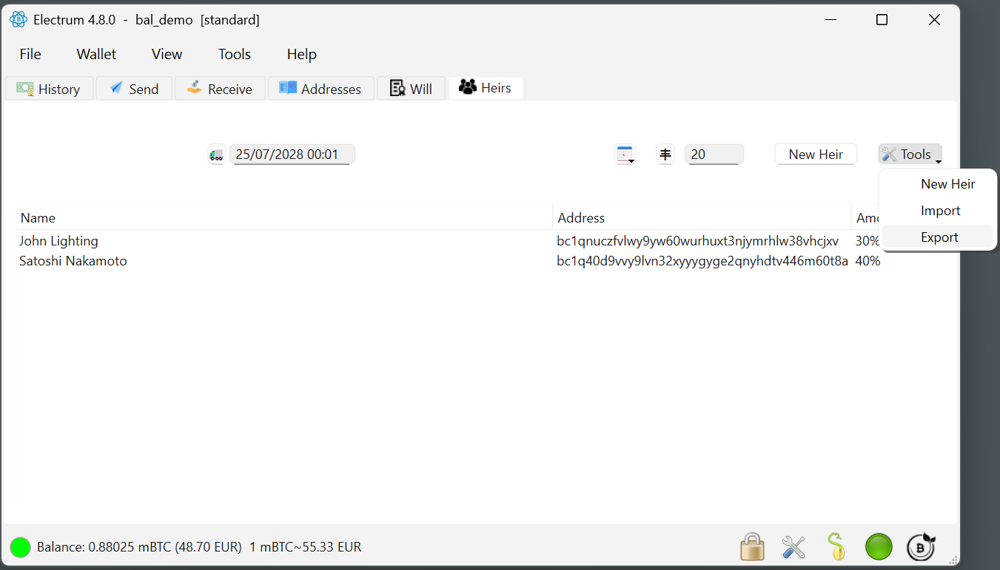

# :material-content-save: Backing up wallet and will

## Where your will actually lives

Your heirs, dates, and inheritance transactions are stored **inside the Electrum wallet file** — not in your seed.

!!! danger "Restoring from seed does not restore your will"
    If you recreate the wallet from its seed phrase you get your **bitcoin** back, but the BAL inheritance configuration is **gone**. Only the wallet file carries it.

## How to back it up

Use Electrum's own command: **File → Save backup**.

If your computer is stolen or fails, install Electrum plus the BAL plugin on a new machine and open the saved wallet file — your will is there, intact.

!!! warning "Keep the wallet password"
    Without it you cannot open the wallet file, and therefore cannot reach the inheritance data stored inside it.

## Export the heirs list

You can export the list of heirs to keep a readable, printable copy of your arrangement.

{ .screenshot }
*A printable record of who inherits what.*

!!! tip "Store it thoughtfully"
    That export tells anyone who reads it who your heirs are and how much they receive. Treat it with the same care as any other sensitive document — and consider whether the heirs themselves should know in advance.

## A sensible backup routine

| What | Where | When |
|---|---|---|
| Wallet file (contains the will) | Two separate physical locations | After every meaningful change to the will |
| Wallet password | Password manager or a sealed physical note | Once, and whenever you change it |
| Seed phrase | Offline, separate from the above | Once |
| [Offline backup transaction](backup-transaction.md) (optional) | USB / notary / trusted person | Every time the will is refreshed |
