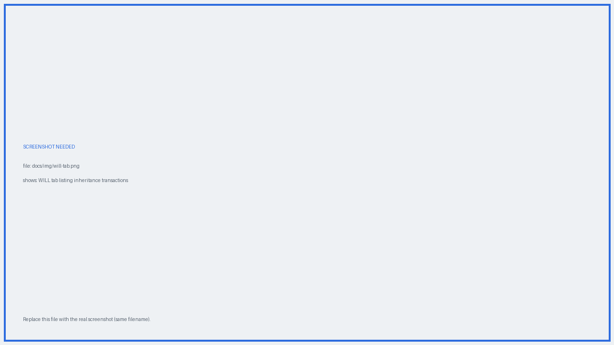
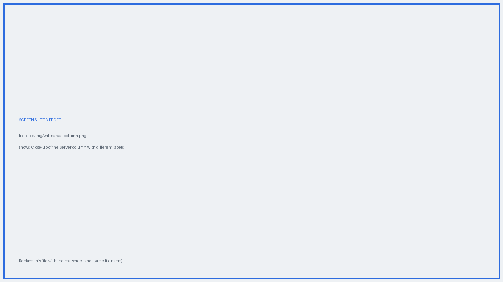
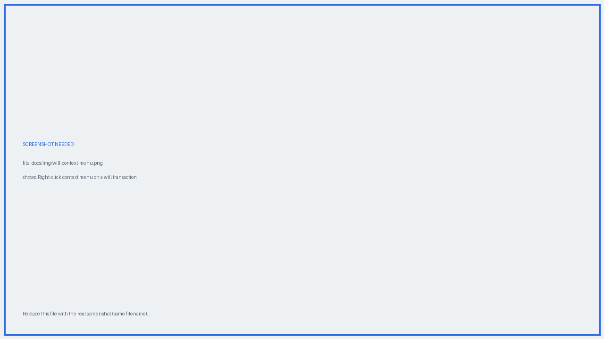
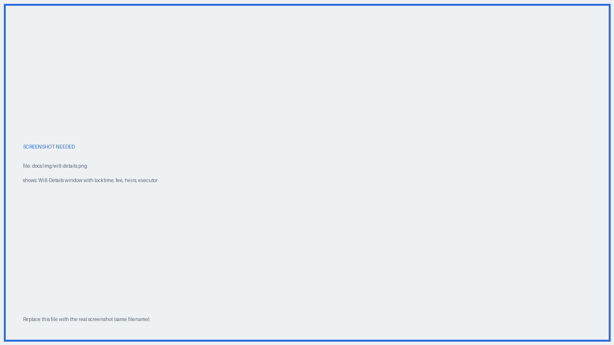

# The WILL tab

The **WILL** tab is the technical view of your inheritance: one row per inheritance transaction, per Will-Executor.

{ .screenshot }
*Each row is a signed inheritance transaction held by one Will-Executor.*

## Columns

| Column | Meaning |
|---|---|
| **Locktime** | The delivery date of the inheritance |
| **Txid** | Identifier of the Bitcoin transaction |
| **Will-Executor** | Which server holds this copy |
| **Server** | Whether that server actually has it (see below) |
| **Status** | Progress of the transaction itself |

## The Server column

The Server column tells you, independently of the row colour, whether each inheritance transaction is really stored on its Will-Executor.

{ .screenshot }
*The Server column reports storage state per Will-Executor.*

| Label | Meaning |
|---|---|
| **Confirmed on server** | The Will-Executor confirmed it has stored the transaction |
| **Sent (not checked)** | Pushed to the Will-Executor, not re-checked since |
| **Send failed / Not on server** | The push failed, or the server no longer has it |
| **Signed (not sent)** | Signed locally, not sent to any Will-Executor |
| **Not sent** | Not signed or sent yet |

!!! tip "Check your wills periodically"
    Right-click a transaction and use the check action to re-query the servers. A row that drifts to *Not on server* is a signal that this Will-Executor is no longer reliable — consider [renewing your will](updating.md) with a different selection.

## Actions

{ .screenshot }
*Right-click a row to act on it.*

| Action | What it does |
|---|---|
| **Prepare** | Builds the inheritance transaction and adds it to the list |
| **Sign** | Signs it — Electrum asks for your password or hardware wallet confirmation |
| **Broadcast / push** | Sends the signed transaction to the selected Will-Executors |
| **Check** | Asks each server whether it still holds its copy, and updates the Server column |
| **Display / Details** | Opens the Will-Details window |

!!! note "The plugin finishes the job on close"
    When you close Electrum, the plugin completes any of prepare / sign / broadcast that is still pending — asking you to confirm the signature. It never signs on your behalf.

## Will details

{ .screenshot }
*Everything about one inheritance transaction in one window.*

The details window shows the locktime (delivery date), the creation time, the miner fee, the current status, the list of heirs, the Will-Executor address, and the Will-Executor's fee.
