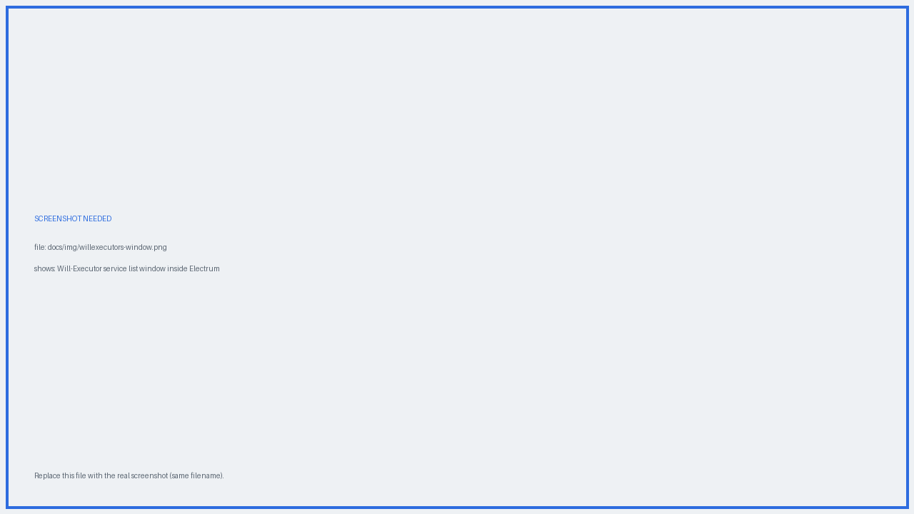
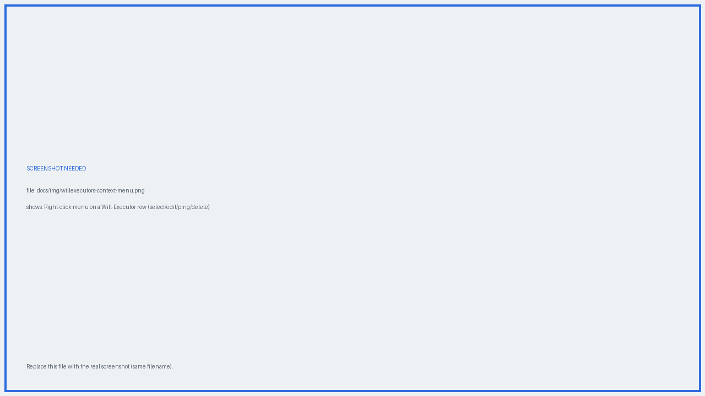

# Choosing Will-Executors in the plugin

The plugin downloads the [WeList](welist.md) directory by default and tries to use as many Will-Executors as possible. You can also add servers manually, or draw from alternative lists — the WeList makes discovery easier, it does not control access to the network.

The service list window opens from the Electrum menu: **Tools → Will-executor**.

{ .screenshot }
*The list of known Will-Executors, with fees and online status.*

## Columns

| Column | Meaning |
|---|---|
| **URL** | Address of the Will-Executor |
| **Base fee** | The commission that server asks, paid only on execution |
| **Info** | Description or website link |
| **Default address** | Bitcoin address where the fee will be sent |
| **Status** | Green dot = server responding |

## Commands

| Command | What it does |
|---|---|
| **Ping** | Checks which servers are online |
| **Import** | Imports a Will-Executor list other than the default |
| **Export** | Exports your list — useful when moving to another Electrum installation |
| **Add** | Adds a Will-Executor manually |

## Per-server actions

{ .screenshot }
*Right-click a row for per-server actions.*

- **Select** — includes this Will-Executor in your inheritance (green check mark).
- **Edit** — edits the corresponding field.
- **Ping** — checks whether that server is online.
- **Delete** — removes it from your list.

## How to choose well

- **Quantity first.** One transaction is created per selected server, and only one has to survive to the delivery date. Select generously.
- **Ignore extremes on price.** Too expensive eats into the inheritance; suspiciously cheap may not survive for years.
- **Prefer diversity.** Different operators, different hosting, different jurisdictions — the point of redundancy is that failures are uncorrelated.
- **Re-check periodically.** Use the [Server column](../user-guide/will-tab.md#the-server-column) to confirm your wills are still stored, and renew the will if servers have disappeared.

!!! info "Adding a server by hand"
    You are not limited to the WeList. Servers announced on BitcoinTalk or shared through alternative directories can be added manually with **Add**.
