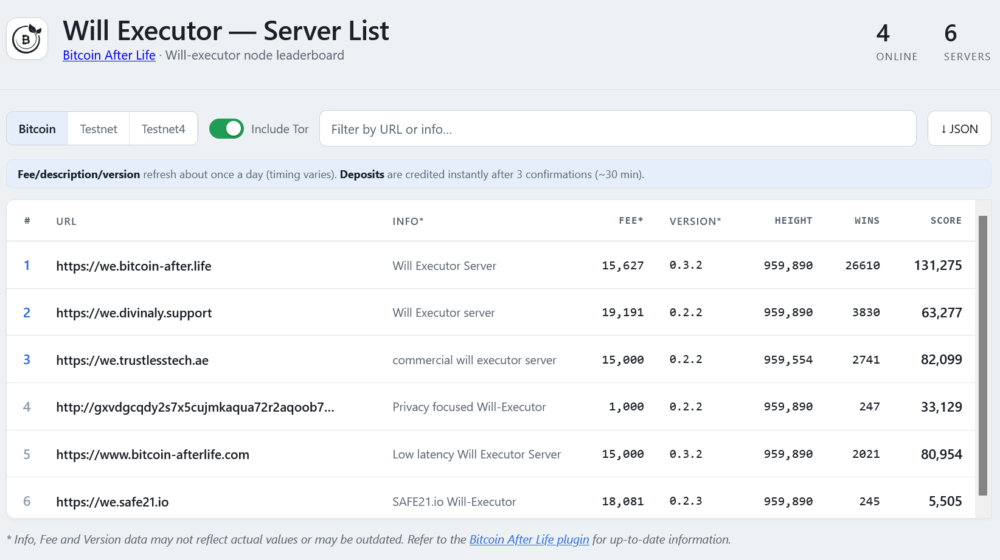

# :material-format-list-bulleted: The WeList directory

The **WeList** is the public directory of Will-Executors, published at [welist.bitcoin-after.life](https://welist.bitcoin-after.life/). The plugin downloads it by default, so listed servers appear automatically when you set up a will.

{ .screenshot }
*The public Will-Executor leaderboard.*

## What it shows

For each server: URL, description, fee, software version, block height, wins, and score. You can filter by network (**Bitcoin**, **Testnet**, **Testnet4**, **Regtest**) and choose whether to include **Tor** servers. The list is also available as **JSON** for programmatic use.

!!! note "Data freshness"
    Fee, description and version refresh roughly once a day, and may be outdated. The plugin remains the authoritative source at the moment you build your will.

## Ranking

Servers are ordered by: excess donated over the yearly fee, then total amount paid, then lower base fee, then WeTime points.

## Listing your own server

| | |
|---|---|
| **Yearly fee** | {{ bal.welist_fee_sats }} sats |
| **Listing period** | {{ bal.welist_period_days }} days, starting when the payment reaches 3 confirmations (~30 min) |
| **Renewal window** | From 6 months before expiry, for one additional year |
| **Plugin integration** | Automatic once listed |

The procedure: enter your server URL on the WeList site, accept the [terms](https://welist.bitcoin-after.life/terms.html), and pay the invoice. Your server appears once the deposit confirms.

!!! warning "Before you pay"
    Make sure your server is **online and reachable** at the exact URL you submit. There are no refunds after payment, and later URL changes require proof of ownership.

## Listing is optional

Being on the WeList is **not** required to operate a Will-Executor. Users can add servers manually, and the plugin can draw from alternative lists. The WeList exists to simplify discovery, not to gate participation in the network.
